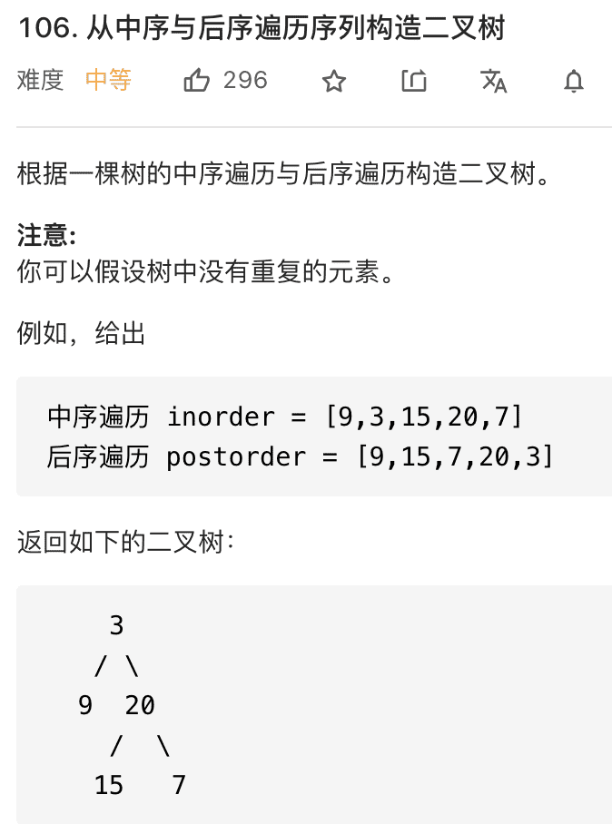

### 二叉树的框架第二期


读完本文，你能去力扣解决如下题目：

654.最大二叉树（难度 **Medium**）

105.从前序与中序遍历序列构造二叉树（难度 **Medium**）

106.从中序与后序遍历序列构造二叉树（难度 **Medium**）

先来复习一个写二叉树的算法关键思路如下：**把题目的要求细化，搞清楚节点应该做什么，然后剩下的事情交给前/中/后序的遍历的框架就行了，我们千万不要跳进递归的细节里面。**


#### 构造最大二叉树


函数签名如下：

```
TreeNode constructMaximumBinaryTree(int[] nums);
```

按照我们刚才说的，先明确根节点做什么？**对于构造二叉树的问题，根节点要做的就是把想办法把自己构造出来**。


我们肯定要遍历数组把找到最大值`maxVal`，把根节点`root`做出来，然后对`maxVal`左边的数组和右边的数组进行递归调用，作为`root`的左右子树。

```java
TreeNode constructMaximumBinaryTree(int[] nums) {
    if (nums is empty) return null;
    // 找到数组中的最大值
    int maxVal = Integer.MIN_VALUE;
    int index = 0;
    for (int i = 0; i < nums.length; i++) {
        if (nums[i] > maxVal) {
            maxVal = nums[i];
            index = i;
        }
    }

    TreeNode root = new TreeNode(maxVal);
    // 递归调用构造左右子树
    root.left = constructMaximumBinaryTree(nums[0..index-1]);
    root.right = constructMaximumBinaryTree(nums[index+1..nums.length-1]);
    return root;
}
```

看懂了吗？**对于每个根节点，只需要找到当前`nums`中的最大值和对应的索引，然后递归调用左右数组构造左右子树即可**。

明确了思路，我们可以重新写一个辅助函数`build`，来控制`nums`的索引：

```java
/* 主函数 */
TreeNode constructMaximumBinaryTree(int[] nums) {
    return build(nums, 0, nums.length - 1);
}

/* 将 nums[lo..hi] 构造成符合条件的树，返回根节点 */
TreeNode build(int[] nums, int lo, int hi) {
    // base case
    if (lo > hi) {
        return null;
    }

    // 找到数组中的最大值和对应的索引
    int index = -1, maxVal = Integer.MIN_VALUE;
    for (int i = lo; i <= hi; i++) {
        if (maxVal < nums[i]) {
            index = i;
            maxVal = nums[i];
        }
    }

    TreeNode root = new TreeNode(maxVal);
    // 递归调用构造左右子树
    root.left = build(nums, lo, index - 1);
    root.right = build(nums, index + 1, hi);

    return root;
}

```

### 通过前序和中序遍历结果构造二叉树


`preorder`和`inorder`数组中的元素分布有如下特点：


找到根节点是很简单的，前序遍历的第一个值`preorder[0]`就是根节点的值，关键在于如何通过根节点的值，将`preorder`和`postorder`数组划分成两半，构造根节点的左右子树？


```java
/* 主函数 */
TreeNode buildTree(int[] preorder, int[] inorder) {
    return build(preorder, 0, preorder.length - 1,
                 inorder, 0, inorder.length - 1);
}
TreeNode build(int[] preorder, int preStart, int preEnd, 
               int[] inorder, int inStart, int inEnd) {

    if (preStart > preEnd) {
        return null;
    }

    // root 节点对应的值就是前序遍历数组的第一个元素
    int rootVal = preorder[preStart];
    // rootVal 在中序遍历数组中的索引
    int index = 0;
    for (int i = inStart; i <= inEnd; i++) {
        if (inorder[i] == rootVal) {
            index = i;
            break;
        }
    }

    int leftSize = index - inStart;

    // 先构造出当前根节点
    TreeNode root = new TreeNode(rootVal);
    // 递归构造左右子树
    root.left = build(preorder, preStart + 1, preStart + leftSize,
                      inorder, inStart, index - 1);

    root.right = build(preorder, preStart + leftSize + 1, preEnd,
                       inorder, index + 1, inEnd);
    return root;
}
```

最后root = ...

root.left = ....  root.right = ....  还有build对应的下标是关键


### 通过后序和中序遍历结果构造二叉树

类似上一题，这次我们利用**后序**和**中序**遍历的结果数组来还原二叉树，

这是力扣第 106 题：



`preorder`和`inorder`数组中的元素分布有如下特点：


这道题和上一题的关键区别是，后序遍历和前序遍历相反，根节点对应的值为`postorder`的最后一个元素。

整体的算法框架和上一题非常类似，我们依然写一个辅助函数`build`：

```java
TreeNode buildTree(int[] inorder, int[] postorder) {
    return build(inorder, 0, inorder.length - 1,
                 postorder, 0, postorder.length - 1);
}

TreeNode build(int[] inorder, int inStart, int inEnd,
               int[] postorder, int postStart, int postEnd) {
    // root 节点对应的值就是后序遍历数组的最后一个元素
    int rootVal = postorder[postEnd];
    // rootVal 在中序遍历数组中的索引
    int index = 0;
    for (int i = inStart; i <= inEnd; i++) {
        if (inorder[i] == rootVal) {
            index = i;
            break;
        }
    }

    TreeNode root = new TreeNode(rootVal);
    // 递归构造左右子树
    root.left = build(preorder, ?, ?,
                      inorder, ?, ?);

    root.right = build(preorder, ?, ?,
                       inorder, ?, ?);
    return root;
}
```

现在`postoder`和`inorder`对应的状态如下：


综上，可以写出完整的解法代码：

```java
TreeNode build(int[] inorder, int inStart, int inEnd,
               int[] postorder, int postStart, int postEnd) {

    if (inStart > inEnd) {
        return null;
    }
    // root 节点对应的值就是后序遍历数组的最后一个元素
    int rootVal = postorder[postEnd];
    // rootVal 在中序遍历数组中的索引
    int index = 0;
    for (int i = inStart; i <= inEnd; i++) {
        if (inorder[i] == rootVal) {
            index = i;
            break;
        }
    }
    // 左子树的节点个数
    int leftSize = index - inStart;
    TreeNode root = new TreeNode(rootVal);
    // 递归构造左右子树
    root.left = build(inorder, inStart, index - 1,
                        postorder, postStart, postStart + leftSize - 1);

    root.right = build(inorder, index + 1, inEnd,
                        postorder, postStart + leftSize, postEnd - 1);
    return root;
}

```

有了前一题的铺垫，这道题很快就解决了，无非就是`rootVal`变成了最后一个元素，再改改递归函数的参数而已，只要明白二叉树的特性，也不难写出来。

最后呼应下前文，**做二叉树的问题，关键是把题目的要求细化，搞清楚根节点应该做什么，然后剩下的事情抛给前/中/后序的遍历框架就行了**。