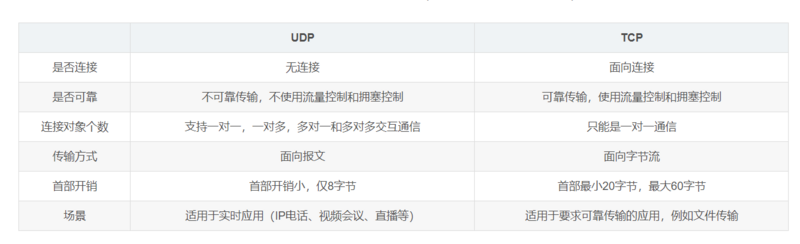

>计算机网络体系结构

在计算机网络的基本概念中，分层次的体系结构是最基本的。计算机网络体系结构的抽象概念较多，要多学习。

#### 网络协议是什么？

在计算机网络要做到有条不紊交换数据，就必须遵守一些事先约定好的规则，比如交换数据的格式、是否需要发送一个应答信息等等。这些规则成为网络协议。

### 为什么要对网络协议分层

1、简化问题难度和复杂度。由于各层之间独立，我们可以分割大问题小问题。

2、灵活性好。当其中一层的技术变化时，只要层间接口关系保持不变，其他层不受影响。

3、易于实现和维护。

4、促进标准化工作，分开后每层功能可以相对简单地被描述。

**网络协议分层的缺点**：功能可能出现多个层里，产生了额外开销。

### TCP/IP四层结构

#### 应用层

应用层（application-layer）的任务是通过应用进程间的交互来完成特定网络应用。应用层协议的定义是应用进程间通信和交互的规则。

对于不同的网络应用需要不同的应用层协议。

#### 运输层

运输层（transport layer）的主要任务就是负责向两台主机进程之间的通信提供数据传输服务。应用进程利用该服务传送应用层报文。

运输层主要使用UDP和TCP：

1、传输控制协议-TCP：提供面向连接的，可靠的数据传输服务。

2、用户数据协议-UDP：提供无连接的，尽最大努力的数据传输服务。（不保证数据传输的可靠性）

### 运行在tcp协议上的协议：

HTTP 浏览器

HTTPS：HTTP协议的安全版本

FTP 文本传输协议

POP3 收邮件

TELNET 通过一个终端登录网络

SSH 用于加密安全登录

### 运行在UDP协议上的协议

BOOTP 用于无盘工作站的局域网中，可以让无盘工作站从一个中心服务器上获得IP地址。

NTP 用于网络同步

DHCP 动态配置IP地址

### 运行在TCP和UDP协议上

DNS 用于完成地址查找，邮件转发等工作。（这里在之前的博客有写过）

#### 网络层

网络层的任务就是选择合适的网间路由和交换节点，确保计算机通信的数据及时传送。在发送数据时，网络层把运输层产生的报文段或用户数据报封装成分组和包进行传送。在TCP/IP体系结构中，由于网络层使用ip协议，因此分组也叫IP数据报。

### 数据链路层

数据链路层通常简称为链路层。两台主机之间的数据传输，总是在一段一段的链路上传送，这就需要使用专门的链路层协议。

在两个相邻节点之间传送数据时，数据链路层将网络层交下来的IP数据报组装成帧，在两个相邻节点间的链路上传送帧。每一帧包含数据和必要的控制信息（如同步信息，地址信息，差错控制等）。

在接受数据时，控制信息使接受端能够知道一个帧从那个比特开始到哪里结束。

一般的web应用的通信传输流如下图：

发送端在层与层之间传输数据时，每经过一层时会被上一个该层所属的首部信息。反之，接受端在层与层之间传输数据时，每经过一层会把对应的首部信息去除。

### TCP的三位握手和四次挥手

TCP是一种面向连接、可靠的、基于字节流的传输层通行协议，通信双方必须在彼此间建立一条连接。所谓的“连接”其实就是客户端和服务端保存一份关于对方的信息，例如ip地址、端口号等。

TCP可以看出一种字节流，它会处理ip层或一下的层的丢包、重复以及错误的问题。在连接建立的过程中，双方需要交换一些连接的参数。这些参数可以放在TCP头部。

一个TCP连接有一个4元组构成，分别是两个ip地址和两个端口号。一个TCP连接通常分为三个阶段：连接、数据传输、退出（关闭）。通过三次握手建立一个连接，通过四次挥手关闭一个连接。

当一个连接被建立或终止时，交换的报文只包含TCP头部，而没有数据。

### 三次握手

**三次握手的本质是确认通信双方收发数据的能力**

## 重点 

首先，我让信使运输一份信件给对方，对方收到了，那么他就知道我的发件能力和他的收件能力是可以的。

于是他给我回信，我若收到了，我便知道我的发件能力和他的收件能力是可以的，并且我还知道了我的收件能力和他的发件能力是可以的。

不过他还不知道他自己的发件能力和我的收件能力是个可以，于是我进行最后一次反馈，他若收到了，他便清楚他的发件能力和我的收件能力。

### 四次挥手

四次挥手的目的是关闭一个连接

比如客户端初始化的序列号ISA=100，服务端初始化的序列号ISA=300。TCP连接成功后客户端总共发送了1000个字节的数据，服务端在客户端发FIN报文前总共回复了2000个字节的数据。

- 第一次挥手：当客户端的数据都传输完成之后，客户端向服务端发出连接是否的报文（当然数据没发完也可以发送连接释放报文并停止发送数据），释放连接报文包含FIN标志位（FIN）、序列号seq=1101（100+1+1000），其中1是建立连接时占的一个序列号。需要注意的是客户端发出的FIN报文段后只是不能发数据了，但还可以正常收数据的；另外fin报文即使不携带数据也要占据一个序列号。

- 第二次挥手：服务端收到客户端发的fin报文之后给客户端回复确认报文，确认报文包含ACK标志位（ACK=1）、确认号ack=1102（客户端fin报文序列号1101+1）、序列号seq=2300（2000+300）。此时服务端处于关闭等待状态，而不是立马给客户端发送fin报文，因此可能还有数据没发完。

- 第三次挥手：服务端发送完最后的数据之间就向客户端发出连接释放报文，报文包含FIN和ACK标志位（FIN=1，ACK=1）确认号和第二次挥手一样的ack=1102、序列号seq=2350

- 第四次挥手：客户端收到服务端发的FIN报文之后，向服务端发出确认报文，确认报文包含ACK标志（ACK=1）、确认号ack=2351、序列号seq=1102.注意客户端发出确认报文后不是立马释放TCP连接，而是经过2MSL（最长报文段寿命的2倍时长）后才释放TCP连接。而服务端一旦收到客户端的发出确认报文就会立马释放TCP连接，所以服务端结束TCP连接的时间会比客户端早一点。

  ### 常见面试题

  #### 为什么TCP连接的时候是三次？两次不可以吗？

  因为需要考虑连接时丢包的问题，如果只握手两次，第二次握手时如果服务端发给客户端的确认报文丢失，此时服务端已经准备好收发了，而客户端一直没有收到服务端的确认报文，所以客户端就不知道服务端是否已经准备好，这种情况下客户端不会给服务端发送数据，也会忽略服务端发来的数据。

  如果是三次握手，即便发生丢包也不会有问题，比如如果第三次握手客户端发的确认ack报文丢失，**服务端在一段时间内没有收到确认ack报文的话就会重新进行第二次握手**，也就是服务端会重发SYN报文段，客户端收到重发的报文段后会再次给服务端发送确认ack报文。

### 为什么客户端发出四次握手的确定之后要等2MSL的时间才能释放TCP连接？

这里同样是要考虑**丢包的问题**，如果第四次挥手的报文丢失，服务端没收到确认ack报文就会重发第三次挥手的报文，这样报文一去一回最长时间就是2MSL，所以需要等这么长时间来确认服务端确实已经收到了。

##### 如果已经建立了连接，但是客户端突然出现故障了怎么办？

TCP设有一个保活计时器，客户端如果出现故障，服务器不能一直等下去，白白浪费资源。服务器每收到一次客户端的请求后都会重新复位这个计时器，时间通常是设置为2小时，若两小时还没有收到客户端的任何数据，服务器就会发送一个探测报文段，以后每隔75秒钟发送一次。若一连发送10个探测报文仍然没反应，服务器就认为客户端出了故障，接着就关闭连接。（类似于心跳机制）