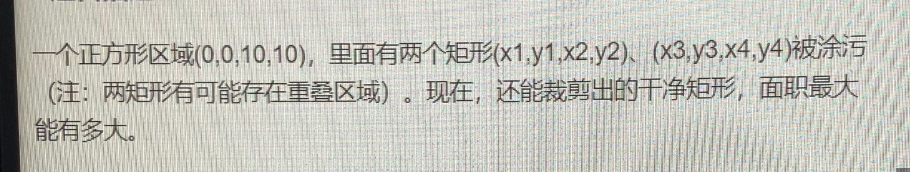

>笔试

### 奇安信笔试




以个正方形区域（0，0，10，10）,里面有两个知形（x1,y1,x2,y2）,(x3,y3,x4,y4) (两个正方形可能重叠）。现在,还能裁剪出的干净矩形面职最大能有多大

思路：四层循环暴力法遍历每一个矩形

```

public class qianxing0912_2 {
    private static int max=0;

    public static int getMaxArea(int x1, int y1, int x2, int y2, int x3, int y3, int x4, int y4){
        for(int i=0;i<10;i++){
            for(int j=0;j<10;j++){
                dfs(i,j,x1,y1,x2,y2,x3,y3,x4,y4);//遍历生产左下点
            }
        }
        return max;
    }

    static void dfs(int x, int y, int x1, int y1, int x2, int y2, int x3, int y3, int x4, int y4){
        for(int i=x+1;i<10;i++) {
            for (int j = y + 1; j < 10; j++) {
                if ((i-x)*(j-y)>max){
                    if(judge(x,y,i,j,x1,y1,x2,y2)&&judge(x,y,i,j,x3,y3,x4,y4)){
                        max=(i-x)*(j-y);
                    }
                }

            }
        }
    }
    //可以生产矩形
    public static boolean judge(int x,int y,int i,int j,int x1,int y1,int x2,int y2){
        if (x1 <= x && x2 <= x)  return true; //生成矩阵左上（x,y）右下（i，j）
        if (x1 >= i && x2 >= i)  return true; //污染矩阵（x1,y1,x2,y2）
        if (y1 <= y && y2 <= y)  return true;
        if (y1 >= j && y2 >= j)  return true;
        return false;
    }

    public static void main(String[] args) {
        System.out.println(getMaxArea(4,1,6,9,1,4,9,6));
    }

}

```