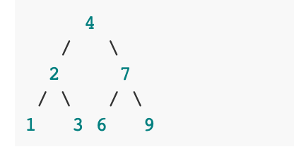
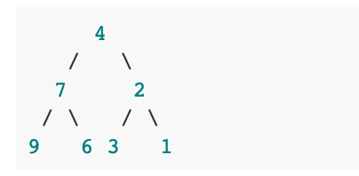
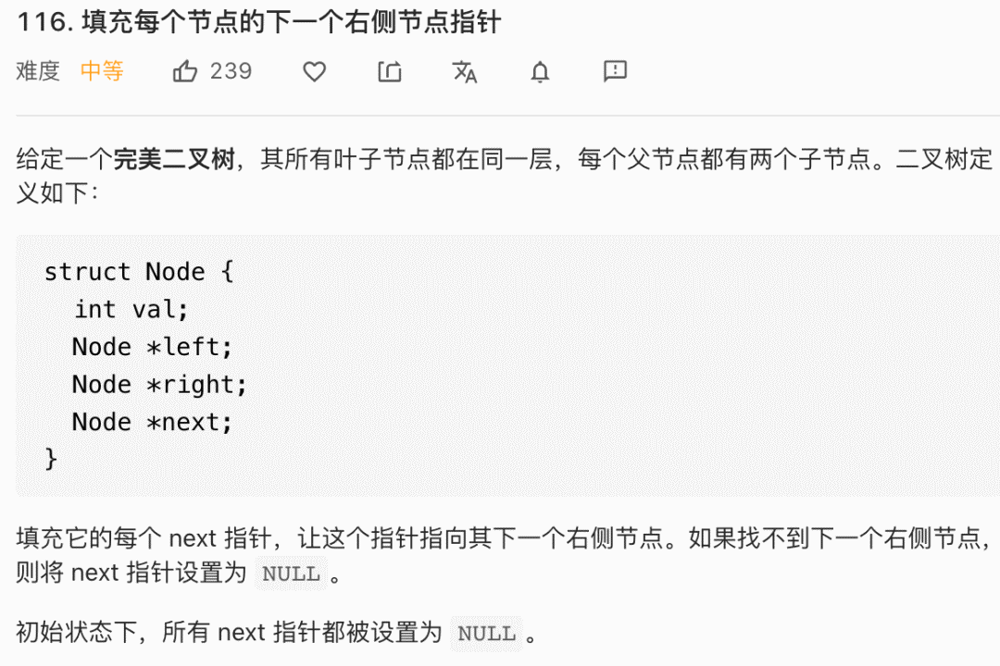
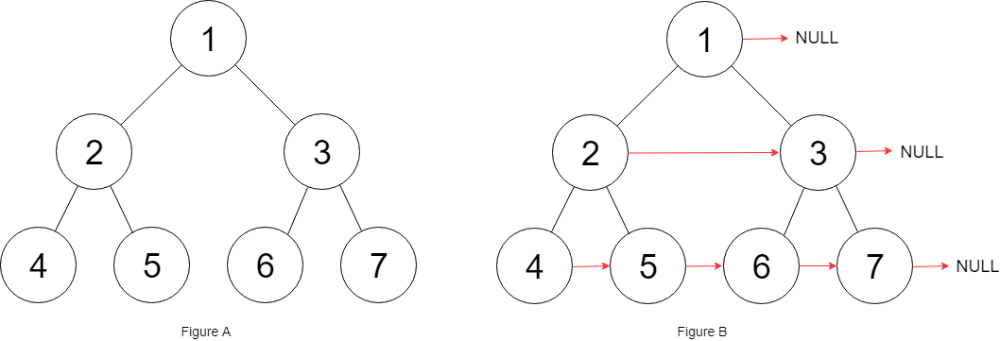
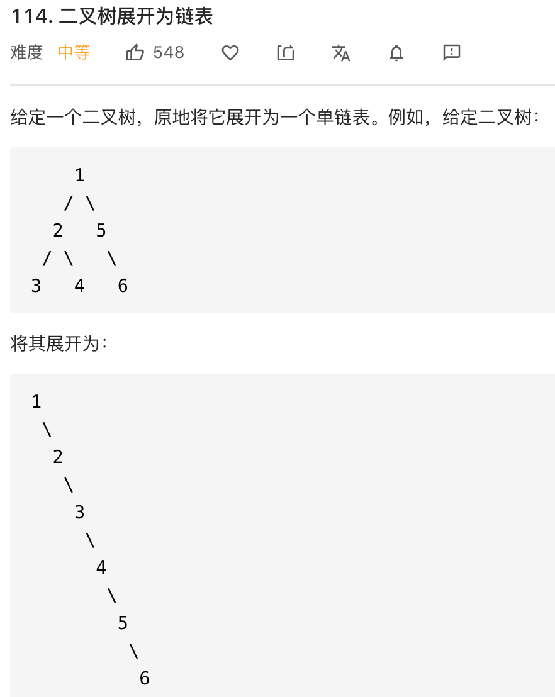

### Warmingzzz二叉树的框架


### 二叉树的重要性

labuladong一直强调先刷二叉树的重要性，因为很多经典的算法，以及所有的回溯、动归，分治算法，其实都是树的问题，而树的问题就永远逃不开树的递归遍历这几行破代码：

```java
/* 二叉树遍历框架 */
void traverse(TreeNode root) {
    // 前序遍历
    traverse(root.left)
    // 中序遍历
    traverse(root.right)
    // 后序遍历
}
```

举个例子，比如说我们的经典算法「快速排序」和「归并排序」，对于这两个算法，你有什么理解？如果你告诉我，快速排序就是二叉树的前序遍历，归并排序就是二叉树的后序遍历，那么你的算法基础肯定不错啦。

为什么快速排序和归并排序能和二叉树扯上关系？我们来简单分析一下他们的算法思想和代码框架：

快速排序的逻辑是，若要对nums[ lo...hi] 进行排序，我们先找一个分界点p，通过交换元素使得nums[lo .. p-1]都小于等于nums[p]，且nums[p+1 .. hi]都大于nums[p]，然后递归去nums[lo .. p-1]和nums[p+1 .. hi]中寻找新的分界点，最后整个数组就排序完了。

快速排序的代码框架如下：

```java
void sort(int[] nums, int lo, int hi) {
    /****** 前序遍历位置 ******/
    // 通过交换元素构建分界点 p
    int p = partition(nums, lo, hi);
    /************************/

    sort(nums, lo, p - 1);
    sort(nums, p + 1, hi);
}
```


先构造分界点，然后去对左右子数组构造分界点，你看这个不就是一个二叉树的前序遍历吗？

再说说归并排序的逻辑，若对nums[lo .. hi]进行排序，我们先对nums[lo.. mid]排序，再对nums[mid+1 .. hi] 排序，最后把这两个有序的子数组合并，整个数组就排好序了。

归并排序的代码框架如下：

```java
void sort(int[] nums, int lo, int hi) {
    int mid = (lo + hi) / 2;
    sort(nums, lo, mid);
    sort(nums, mid + 1, hi);

    /****** 后序遍历位置 ******/
    // 合并两个排好序的子数组
    merge(nums, lo, mid, hi);
    /************************/
}
```

先对左右子数组排序，然后合并（类似合并有序链表的逻辑），你看这是不是二叉树的后序遍历框架？另外，这不就是传说中的分治算法吗，不过如此？

如果你一眼就识破了这些排序算法的底细，还需要背这些算法代码吗？这不是手到擒来，从框架慢慢拓展就能写出算法了。

### 二、写递归算法的秘诀

我们前文 [用 Git 来讲讲二叉树最近公共祖先](http://mp.weixin.qq.com/s?__biz=MzAxODQxMDM0Mw==&mid=2247485561&idx=1&sn=a394ba978283819da1eb34a256f6915b&chksm=9bd7f671aca07f6722f0bc1e946ca771a0a40fd8173cc1227a7e0eabfe4e2fcc57b9ba464547&scene=21#wechat_redirect) 写过，**写递归算法的关键是要明确函数的「定义」是什么，然后相信这个定义，利用这个定义推导最终结果，绝不要试图跳入递归**。


怎么理解呢，我们用一个具体的例子来说，比如你计算一个二叉树一共有几个节点：

```java
// 定义：count(root) 返回以 root 为根的树有多少节点
int count(TreeNode root) {
    // base case
    if (root == null) return 0;
    // 自己加上子树的节点数就是整棵树的节点数
    return 1 + count(root.left) + count(root.right);
}
```

这个问题非常简单，大家应该都会。

**写树的相关算法，简单就是先搞清楚当前的root节点该做什么，然后根据函数定义递归调用子节点，递归调用会让孩子节点做相同的事情。**

我们接下来看几道算法题目实操一下。

### 三、算法实践

#### 翻转二叉树

我们先从简单题开始，leetcode 226「翻转二叉树」，输入一个二叉树根节点root，让你把整颗树镜像翻转，比如输入二叉树如下：



算法原地翻转二叉树，如下：



通过观察，**我们发现只要把二叉树上的每一个节点的左右节点进行交换，最后的结果就是完全翻转之后的二叉树。**

可以直接写出解法代码：

```java
// 将整棵树的节点翻转
TreeNode invertTree(TreeNode root) {
    // base case
    if (root == null) {
        return null;
    }

    /**** 前序遍历位置 ****/
    // root 节点需要交换它的左右子节点
    TreeNode tmp = root.left;
    root.left = root.right;
    root.right = tmp;

    // 让左右子节点继续翻转它们的子节点
    invertTree(root.left);
    invertTree(root.right);

    return root;
}
```

这道题目比较简单，关键思路在于我们发现翻转整颗树就是交换每个节点的左右子节点，于是我们把交换左右子节的代码放在前序遍历的位置。

值得一提的是，如果把交换左右节点的代码放在后序遍历的位置也是可以的，但是放在中序遍历的位置是不行的，请你想一想为什么？


首先这题告诉你，**二叉树题目的一个难点就是，如何把题目的要求细化成每个节点需要做的事情。**

### 第二题、填充二叉树节点的右侧指针



题目的意思就是把二叉树的每一层节点都用next指针连接起来：



而且题目说了，输入是一颗「完美二叉树」，形象地说整颗二叉树是一个正三角形，除了最右侧的节点next指针会指向null，其他节点的右侧一定有相邻的节点。


这道题怎么做呢？把每一层的节点穿起来，是不是只要把每个节点的左右子节点都穿起来就行了？

我们可以模仿上面的代码，写出下面的代码：

```java
Node connect(Node root) {
    if (root == null || root.left == null) {
        return root;
    }

    root.left.next = root.right;

    connect(root.left);
    connect(root.right);

    return root;
}
```

其实这样有很大的问题


节点5和节点6不属于同一个父节点，那么按照这段代码的逻辑，他两就没有办法被穿起来，这是不符合题意的。

回想刚才说的，二叉树的问题难点在于，如何把题目的要求细化成为每个节点需要做的事情，如果只依赖一个节点的话，肯定是没办法连接「跨父节点」的两个相邻节点的。

那么，我们的做法就是增加函数参数，一个节点做不到，我们就给他安排两个节点，「将每一层二叉树节点连接起来」可以细化成「将每两个相邻节点都连接起来」：

```java
// 主函数
Node connect(Node root) {
    if (root == null) return null;
    connectTwoNode(root.left, root.right);
    return root;
}

// 定义：输入两个节点，将它俩连接起来
void connectTwoNode(Node node1, Node node2) {
    if (node1 == null || node2 == null) {
        return;
    }
    /**** 前序遍历位置 ****/
    // 将传入的两个节点连接
    node1.next = node2;

    // 连接相同父节点的两个子节点
    connectTwoNode(node1.left, node1.right);
    connectTwoNode(node2.left, node2.right);
    // 连接跨越父节点的两个子节点
    connectTwoNode(node1.right, node2.left);
}
```

### 第三题、将二叉树展开为链表



给flatten函数输入一个节点root，那么root为根的二叉树就会被拉平为一条链表。

我们再梳理一下，如何按题目要求把一棵树拉平成为一条链表？

1、将root的左子树和右子树拉平。

2、将root的右子树接到左子树下方，然后将整个左子树作为右子树

上面三步看起来最难的应该是第一步，如何把root的左右子树拉平？其实很简单，按照flatten函数的定义，对root的左右子树递归调用flatten函数即可：

```java
// 定义：将以 root 为根的树拉平为链表
void flatten(TreeNode root) {
    // base case
    if (root == null) return;

    flatten(root.left);
    flatten(root.right);

    /**** 后序遍历位置 ****/
    // 1、左右子树已经被拉平成一条链表
    TreeNode left = root.left;
    TreeNode right = root.right;

    // 2、将左子树作为右子树
    root.left = null;
    root.right = left;

    // 3、将原先的右子树接到当前右子树的末端
    TreeNode p = root;
    while (p.right != null) {
        p = p.right;
    }
    p.right = right;
}

```

你看，这就是递归的魅力，你说`flatten`函数是怎么把左右子树拉平的？不容易说清楚，**但是只要知道`flatten`的定义如此，相信这个定义，让`root`做它该做的事情，然后`flatten`函数就会按照定义工作。**

另外注意递归框架是后序遍历，因为我们要先拉平左右子树才能进行后续操作。

至此，这道题也解决了，我们旧文 [递归思维：k 个一组反转链表](http://mp.weixin.qq.com/s?__biz=MzAxODQxMDM0Mw==&mid=2247484597&idx=1&sn=c603f1752e33cb2701e371d84254aee2&chksm=9bd7fabdaca073abd512d8fff18016c9092ede45fed65c307852c65a2026d8568ee294563c78&scene=21#wechat_redirect) 的递归思路和本题也有一些类似。

### 四、最后总结

递归算法的关键要明确函数的定义，相信这个定义，而不要跳进递归的细节。

写二叉树的算法题，都是基于递归框架的，我们要搞清楚root节点它自己要做什么，然后根据题目要求使用前序、中序、后序的递归框架。

二叉树题目的难点在于如何通过题目的要求思考出每一个节点需要做什么，这个只能通过多刷题进行练习了。

