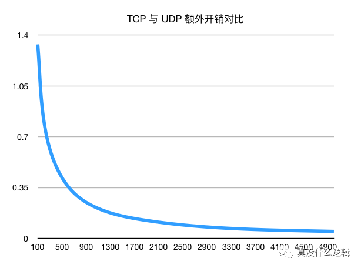

### 为什么DNS使用UDP协议

今天要分析的具体问题是「为什么DNS使用UDP协议」，DNS作为整个互联网的电话簿，它能够将可以被人理解的域名翻译成可以被机器理解的IP地址，使得互联网的使用者不需要直接接触很难阅读和理解的IP地址。相信DNS使用UDP协议已经成为了软件工程师的常识，对计算机网络稍有理解的人都知道DNS会使用UDP协议传输数据，但是这一观点其实不是完全正确的，我们在这里就会详细分析「为什么DNS会使用UDP传输数据」以及「为什么DNS不止会使用UDP传输数据」两个问题，希望能够帮助各位读者理解DNS协议的全貌。

### 概述

----------

我们要讨论的两个问题其实并不冲突，在绝大多数情况下，DNS都是使用UDP协议进行通信的，DNS协议在设计之初也推荐我们进行域名解析时首先使用UDP，这确定能解决很多需求，但是不能解决全部的问题。

实际上，DNS不仅使用了UDP协议，也使用了TCP协议，不过在具体介绍今天的问题之前，我们还是要对DNS协议进行简单的介绍：DNS查询的类型不至于包含A记录、CHAME记录等常见查询，还包含AXFR类型的特殊查询，这种特殊查询主要用于DNS区域传输、它的作用就是用在多个命名服务器之间快速迁移记录，由于查询返回的响应比较大，所以会使用TCP协议来传输数据包。

作为被广泛使用的协议，我们能够找到非常多的DNS相关的RFC文档，DNS Camel Viewer中列出了将近300个与DNS协议相关的RFC文档，其中有6个是目前的互联网标准，有102个是DNS相关的提案，这些文档共同构成了我们目前对于DNS协议的设计理解，下面对其中一些重要的文档帮我们理解DNS的发展史以及它与UDP/TCP协议的关系，这里只会摘抄文档中与UDP/TCP协议相关的内容：

1、RFC1034 Domanin Names - Concept and Facilities Internet Standard

​	i.DNS查询可以通过UDP数据包也可以TCP连接进行传输；

​	ii.由于DNS区域传输的功能对于数据的准确有较强的需求，所以我们必须使用TCP或者其他可靠协议来处理AXFR类型的请求；

2、RFC1035 Domain Names -Implement and Specifition

​	i.互联网支持命名服务器通过TCP或者UDP协议进行访问；

​	ii.UDP协议携带的信息不应该超过512字节，超过的信息会被截断并设置DNS协议的TC位，UDP协议对于区域传输功能是不可接受的，不过是互联网上标准查询的推荐协议。通过UDP协议发送的查询可能会丢失，所以需要重传策略解决这个问题；

3、RFC1123 Requirments for Internet Hosts --Application and Support Internet Standard 

​	i.未来定义的新DNS记录类型可能会包含超过512字节的信息，所以我们应该使用TCP协议来传输DNS记录；因此解析器和命名服务器需要使用TCP协议作为UDP无法满足需求的备份。

 	ii.DNS解析器和递归服务器必须支持UDP协议，并且应该支持使用TCP协议发送非区域传输的查询；也就是说，DNS解析器或者服务器在发送非区域传输查询时，必须先发送一个UDP查询，如果该查询的响应被截断，他应该尝试使用TCP协议重新请求；

4、RPC3596 DNS Extensions to Support IP Version 6 Internet Standard

​	i.通过DNS拓展支持IPv6协议，每个IPv6占16个字节是IPv4的四倍；

5、RFC5011 Auromated Updates Of DNS Security Trust Anchors Independent

​	i.新增多种资源记录为DNS客户端的DNS数据来源进行认证，记录包含的数据往往较大；

6、RFC6376 DomainKeys Identified Mail Signatures Internet Standard 

​	i.选择合适的键大小进行加密是需要在成本、性能和风险之间的权衡，然而大的键可能没有办法放到DNS UDP响应中直接返回；

7、RFC6891 Extension Mechanic for DNS Internet Standard

​	i.使用UDP进行传输的DNS查询和响应最大不能超过512字节，不能支持大量IPv6地址或者DNS安全签名等记录的传输；

​	ii.ENDS为DNS提供了拓展功能，让DNS通过UDP协议携带最多4096字节的数据

8、RFC776 

​	i.当客户端接受到一个被阶段的DNS响应时，应该通过TC字段判断是否需要通过TCP协议重复发出DNS查询请求；

​	ii.DNSSEC的引入使得截断的UDP数据包变得非常常见；

​	iii.使用UDP传输DNS的数据包大小超过最大传输单元时可能会导致IP数据包的分片，PRC1123文档中预测的未来已经到来了，唯一一个用于UDP能够携带数据包大小的EDNS机制被认为不够可靠；

​	iv.所有通用DNS实现必须要同时支持UDP和TCP传输协议，其中包含权威服务器、递归服务器以及桩解析器；

​	v.桩解析器和递归服务器可以根据情况选择使用TCP或者UDP查询直接请求目标服务器，以UDP协议来开始发起DNS请求不再时强制性的，TCP协议与UDP协议在DNS查询中可以相互替代，而不是作为重试机制；

9、Specification for DNS over Transport Layer Security (TLS) 

​	i.在DNS协议中引入TLS来为用户提供隐私，减少对DNS查询的窃听和篡改，但是TLS协议的引入会带来一些性能方面的额外开销；

10. i.定义一个通过HTTPS发送DNS查询和获取DNS响应的协议

我们可以简单总结一下DNS的发展史，1987年的RFC1034和RFC1035定义了最初版本的DNS协议，刚被设计出来的DNS就会同时使用UDP和TCP协议，对于最大多数的DNS查询来说都会使用UDP数据包进行传输，TCP协议只会在区域传输的场景中使用，其中UDP数据包只会传输最大的512字节的数据，多余的会被截断；两年后发布的RFC1123预测了DNS记录中存储的数据会越来越多，同时也第一次指出发现UDP包被截断时应该通过TCP协议重试。

通过将近20年的时间，由于互联网的发展，人们已经发现IPV4不够分配了，所以引入了更长的IPV6，DNS也在2003年发布的RFC3596中进行协议上的支持，随后发布的 RFC5011 和 RFC6376 增加了在鉴权和安全方面的支持，但是也带来了巨大的 DNS 记录，UDP 数据包被截断变得非常常见。

DNS 出现之后的 30 多年，RFC7766 才终于提出了使用 TCP 协议作为主要协议来解决 UDP 无法解决的问题，TCP 协议也不再只是一种重试时使用的机制，随后出现的 DNS over TLS 和 DNS over HTTP 也都是对 DNS 协议的一种补充。

### UDP

DNS 协议在过去的几十年中其实都是 DNS 主要使用的协议，作为互联网的标准，目前的绝大多数 DNS 请求和响应都会使用 UDP 协议进行数据的传输，我们通过抓包工具就能轻松获得以 UDP 协议为载体的 DNS 请求和响应。

UDP和TCP的通信机制非常不同，作为可靠传输协议，TCP协议需要通信的双方通过三次握手建立TCP连接之后才可以进行通信，但是在30年前的DNS查询场景中我们其实并不需要稳定的连接（或者以为不需要），每一次DNS查询都会直接命名服务器发送UDP数据包，与此同时常见 DNS 查询的数据包都非常小，TCP 建立连接会带来以下的额外开销：

- TCP 建立连接需要进行三次网络通信；
- TCP 建立连接需要传输 ~130 字节的数据；
- TCP 销毁连接需要进行四次网络通信；
- TCP 销毁连接需要传输 ~160 字节的数据；

假设网络通信所消耗的时间是可以忽略的不计的，如果我们只考虑 TCP 建立连接时传输的数据的话，可以简单来算一笔账：

- 使用 TCP 协（共 330 字节）

- - 三次握手 — 14x3(Ethernet) + 20x3(IP) + 44 + 44 + 32 字节
  - 查询协议头 — 14(Ethernet) + 20(IP) + 20(TCP) 字节
  - 响应协议头 — 14(Ethernet) + 20(IP) + 20(TCP) 字节

- 使用 UDP 协议（共 84 字节）

- - 查询协议头 — 14(Ethernet) + 20(IP) + 8(UDP) 字节
  - 响应协议头 — 14(Ethernet) + 20(IP) + 8(UDP) 字节

需要注意的是，我们在这里计算结果的前提是 DNS 解析器**只需要与一个命名服务器或者权威服务器进行通信**就可以获得 DNS 响应，但是在实际场景中，DNS 解析器可能会递归地与多个命名服务器进行通信，这也加倍地放大了 TCP 协议在额外开销上的劣势。

如果 DNS 查询的请求体和响应分别是 15 和 70 字节，那么 TCP 相比于 UDP 协议会增加 ~250 字节和 ~145% 的额外开销，所以当请求体和响应的大小比较小时，通过 TCP 协议进行传输不仅需要传输更多的数据，还会消耗更多的资源，多次通信以及信息传输带来的时间成本在 DNS 查询较小时是无法被忽视的，TCP 连接带来的可靠性在 DNS 的场景中没能发挥太大的作用。

### TCP

今天的网络状况其实没有几十年前设计的那么简单了，我们不仅遇到了IPv4即将无法分配的状况，而且还需要进入DNSSEC等机制来保证DNS查询和请求的完整性以及传输安全，总而言之，DNS协议需要处理的数据包越来越大、数据也越来越多，但是「为什么当需要传输的数据较多时我们就必须使用TCP协议呢？」如果继续使用UDP协议就不能完成DNS解析么？

从理论上来说，一个 UDP 数据包的大小最多可以达到 64KB，这对于一个常见的 DNS 查询其实是一个非常大的数值；但是在实际生产中，**一旦数据包中的数据超过了传送链路的最大传输单元（MTU，也就是单个数据包大小的上限，一般为 1500 字节），当前数据包就可能会被分片传输、丢弃，部分的网络设备甚至会直接拒绝处理包含 EDNS(0) 选项的请求，这就会导致使用 UDP 协议的 DNS 不稳定。**

从理论上来说，一个 UDP 数据包的大小最多可以达到 64KB，这对于一个常见的 DNS 查询其实是一个非常大的数值；但是在实际生产中，一旦数据包中的数据超过了传送链路的最大传输单元（MTU，也就是单个数据包大小的上限，一般为 1500 字节），当前数据包就可能会被分片传输、丢弃，部分的网络设备甚至会直接拒绝处理包含 EDNS(0) 选项的请求，这就会导致使用 UDP 协议的 DNS 不稳定。

所以，我们在 DNS 中存储较多的内容时，TCP 三次握手以及协议头带来的额外开销就不是关键因素了，不过我们 TCP 三次握手带来的三次网络传输耗时还是没有办法避免的，这也是我们在目前的场景下不得不接受的问题。

### 总结

很多人认为 DNS 使用了 UDP 协议来获取域名对应的 IP 地址，这个观点虽然没错，但是还是有一些片面，更加准确的说法其实是 DNS **查询**在刚设计时主要使用 UDP 协议进行通信，而 TCP 协议也是在 DNS 的演进和发展中被加入到规范的：

1. DNS 在设计之初就在区域传输中引入了 TCP 协议，在查询中使用 UDP 协议；
2. 当 DNS 超过了 512 字节的限制，我们第一次在 DNS 协议中明确了『当 DNS 查询被截断时，应该使用 TCP 协议进行重试』这一规范；
3. 随后引入的 EDNS 机制允许我们使用 UDP 最多传输 4096 字节的数据，但是由于 MTU 的限制导致的数据分片以及丢失，使得这一特性不够可靠；
4. 在最近的几年，我们重新规定了 DNS 应该同时支持 UDP 和 TCP 协议，TCP 协议也不再只是重试时的选择；

这篇文章已经详细介绍了 DNS 的历史以及选择不同协议时考虑的关键点，在这里我们重新回顾一下 DNS 查询选择 UDP 或者 TCP 两种不同协议时的主要原因：

- UDP 协议

- - DNS 查询的数据包较小、机制简单；
  - UDP 协议的额外开销小、有着更好的性能表现；

- TCP 协议

- - DNS 查询由于 DNSSEC 和 IPv6 的引入迅速膨胀，导致 DNS 响应经常超过 MTU 造成数据的分片和丢失，我们需要依靠更加可靠的 TCP 协议完成数据的传输；
  - 随着 DNS 查询中包含的数据不断增加，TCP 协议头以及三次握手带来的额外开销比例逐渐降低，不再是占据总传输数据大小的主要部分；

无论是选择 UDP 还是 TCP，最核心的矛盾就在于需要传输的数据包大小，如果数据包小到一定程度，UDP 协议绝对最佳的选择，但是当数据包逐渐增大直到突破 512 字节以及 MTU 1500 字节的限制时，我们也只能选择使用更可靠的 TCP 协议来传输 DNS 查询和相应。到最后，我们还是来看一些比较开放的相关问题，有兴趣的读者可以仔细思考一下下面的问题：